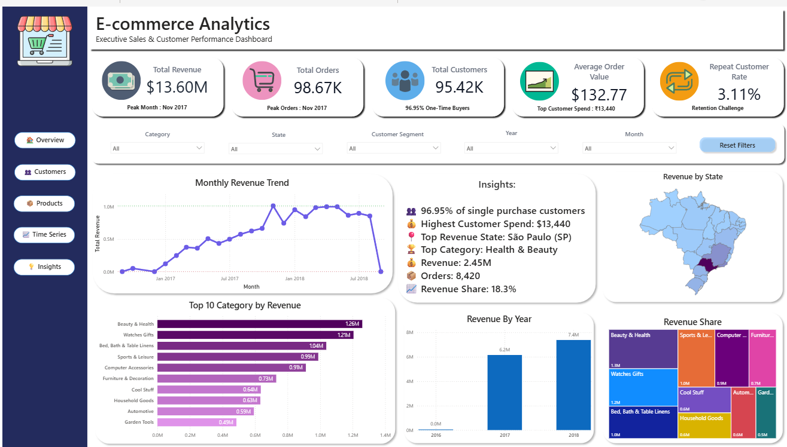
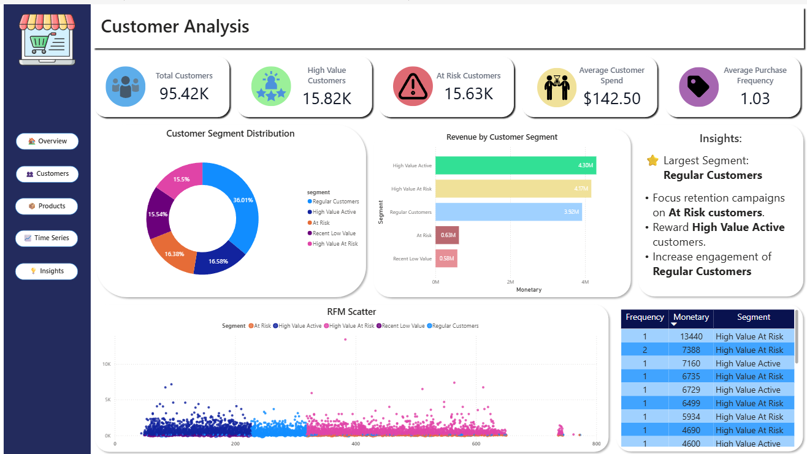
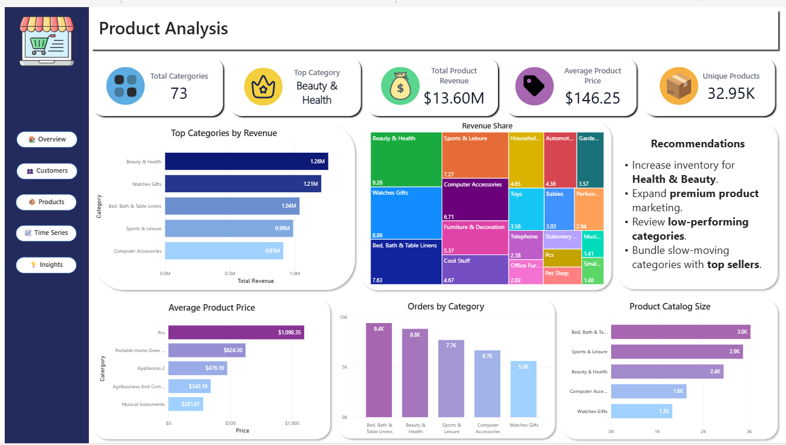
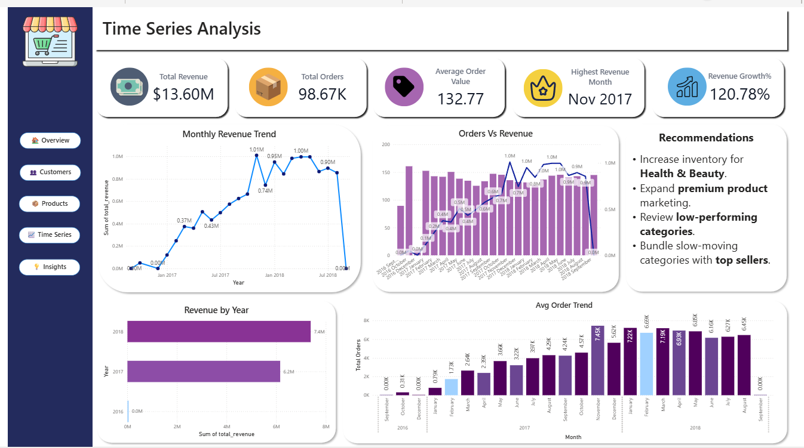
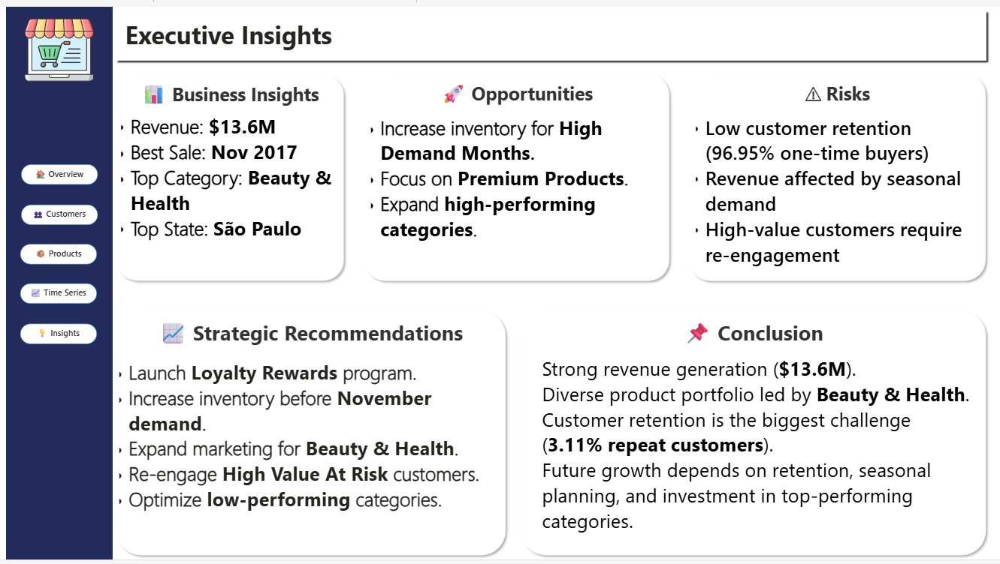

# E-Commerce Customer & Product Analytics

## Project Overview

This project analyzes Brazilian e-commerce transaction data to understand customer purchasing behavior, customer retention, product performance, geographic performance, and revenue trends.

The project uses **SQL** for data analysis and aggregation, **Python** for exploratory analysis, **RFM methodology** for customer segmentation, and **Power BI** for interactive business intelligence reporting.

The final solution transforms raw e-commerce data into actionable insights related to customer retention, high-value customer segments, product category performance, geographic revenue contribution, and sales trends.

---

## Business Objectives

The analysis aims to answer the following business questions:

- How is the business performing in terms of revenue and orders?
- What percentage of customers make repeat purchases?
- Which customers are high-value or at risk?
- Which product categories generate the highest revenue?
- Which categories contribute the most to overall revenue?
- How does revenue and order performance change over time?
- Which geographic markets contribute the most revenue?
- What actions can improve customer retention and business growth?

---

## Tools & Technologies

- **SQL / MySQL** — Data querying, joins, aggregation, RFM analysis
- **Python / Jupyter Notebook** — Data exploration and validation
- **Power BI** — Dashboard development and visualization
- **DAX** — KPI and measure development
- **Power Query** — Data preparation
- **RFM Analysis** — Customer segmentation

---

## Dataset

The project uses the **Brazilian E-Commerce Public Dataset by Olist**.

The analysis primarily uses data related to:

- Customers
- Orders
- Order Items
- Order Payments
- Products
- Geographic information

### Revenue Definition

Revenue in this project is calculated as the **sum of product item prices** from order items and excludes freight charges.

### Key Data Relationships

The primary identifiers used to connect the datasets include:

- `customer_id`
- `customer_unique_id`
- `order_id`
- `product_id`

---

## Analysis Workflow

```text
Raw E-Commerce Data
        ↓
Data Exploration & Validation
        ↓
SQL Analysis & Aggregation
        ↓
RFM Customer Analysis
        ↓
Customer Segmentation
        ↓
Product & Geographic Analysis
        ↓
Time-Series Analysis
        ↓
Power BI Dashboard
        ↓
Business Insights & Recommendations
```

---

## Key Metrics

| Metric | Result |
|---|---:|
| Total Revenue | ~$13.6M |
| Total Orders | ~98K |
| Customers Analyzed | 95K+ |
| One-Time Buyers | ~96.95% |
| Repeat Customer Rate | ~3.11% |
| Highest Revenue Category | Beauty & Health |
| Highest Revenue Month | November 2017 |
| Top Revenue State | São Paulo |

---

# Customer Analysis

RFM analysis was performed using three customer-level metrics:

- **Recency** — Number of days since the customer's most recent purchase
- **Frequency** — Number of distinct orders placed by the customer
- **Monetary** — Total product revenue generated by the customer

Initial analysis showed that **Frequency had limited discriminatory power** because approximately 96.95% of customers purchased only once.

To create more actionable customer groups, segmentation focused primarily on customer recency and monetary value.

The final customer segments include:

- **High Value Active**
- **High Value At Risk**
- **Recent Low Value**
- **At Risk**
- **Regular Customers**

The analysis identified low observed repeat-purchase behavior as one of the most significant business challenges.

---

# Product Analysis

Product categories were evaluated using:

- Total Revenue
- Total Orders
- Average Product Price
- Unique Products
- Revenue Share

**Beauty & Health** emerged as one of the leading revenue-generating categories.

The analysis also compared category-level revenue, demand, pricing, and product assortment to identify high-performing and lower-performing areas of the product portfolio.

---

# Time-Series Analysis

Business performance was analyzed over time using:

- Monthly Revenue
- Monthly Order Volume
- Average Order Value
- Revenue by Year
- Revenue Growth
- Peak Revenue Month

**November 2017** recorded the highest monthly revenue during the analyzed period.

The analysis also showed variations in revenue and order activity over time, indicating opportunities for seasonal inventory and operational planning.

Year-over-year comparisons should be interpreted carefully because the dataset contains partial-year coverage.

---

# Power BI Dashboard

The final Power BI report contains **five interactive analytical pages** designed to provide both executive-level visibility and detailed business analysis.

Dashboard: 

## 1. Executive Overview



The Executive Overview provides a high-level view of:

- Total Revenue
- Total Orders
- Total Customers
- Average Order Value
- Repeat Customer Rate
- Monthly Revenue Trends
- Revenue by State
- Top Product Categories
- Revenue Contribution

---

## 2. Customer Analysis



The Customer Analysis page focuses on:

- Customer Segment Distribution
- High-Value Customers
- At-Risk Customers
- Average Customer Spend
- Purchase Frequency
- Revenue by Customer Segment
- RFM Customer Distribution
- High-Spending Customers

---

## 3. Product Analysis



The Product Analysis page examines:

- Total Product Categories
- Top Revenue Category
- Total Product Revenue
- Average Product Price
- Unique Products
- Top Categories by Revenue
- Category Revenue Share
- Orders by Category
- Product Catalog Size

---

## 4. Time Series Analysis



The Time Series Analysis page tracks:

- Total Revenue
- Total Orders
- Average Order Value
- Highest Revenue Month
- Revenue Growth
- Monthly Revenue Trends
- Orders vs Revenue
- Revenue by Year
- Order Trends

---

## 5. Executive Insights



The Executive Insights page summarizes the findings from the overall analysis into:

- Business Highlights
- Growth Opportunities
- Business Risks
- Strategic Recommendations
- Overall Business Conclusion

---

# Key Business Insights

### 1. Customer Retention Is the Primary Growth Challenge

Approximately **96.95% of analyzed customers made only one purchase**, while the observed repeat customer rate was approximately **3.11%**.

This indicates that the business has a significant opportunity to improve repeat purchasing behavior and long-term customer value.

### 2. High-Value Customers Require Targeted Retention

The customer segmentation identified both **High Value Active** and **High Value At Risk** customer groups.

High-value customers showing declining activity represent an important opportunity for targeted re-engagement campaigns.

### 3. Beauty & Health Is a Leading Revenue Category

Beauty & Health emerged as one of the strongest revenue-generating product categories.

This indicates potential opportunities for focused inventory planning, product availability, and targeted marketing investment.

### 4. Revenue Shows Periods of Higher Demand

Revenue and order activity varied across the analyzed period, with **November 2017** recording the highest monthly revenue.

Historical peak periods can help inform inventory planning, logistics capacity, and promotional strategies.

### 5. Geographic Revenue Is Concentrated in Key Markets

São Paulo emerged as a major revenue-contributing state, highlighting the importance of understanding geographic demand when planning marketing and operational strategies.

---

# Business Recommendations

### Improve Customer Retention

Introduce loyalty rewards, personalized offers, discount coupons, and targeted remarketing campaigns to encourage repeat purchases.

### Re-Engage High-Value At-Risk Customers

Use targeted email campaigns, personalized product recommendations, and exclusive offers to recover valuable customers showing declining activity.

### Invest in High-Performing Categories

Prioritize inventory availability and marketing investment for strong-performing categories such as **Beauty & Health**.

### Prepare for Peak Demand Periods

Use historical revenue and order trends to prepare inventory, logistics capacity, and promotional campaigns before high-demand periods.

### Optimize Low-Performing Categories

Review lower-performing categories using strategies such as:

- Product bundling
- Promotional pricing
- Cross-selling
- Catalog optimization

---

# Repository Structure

```text
Ecommerce-Analytics/
│
├── dashboard/
│   └── Power BI dashboard file
│
├── datasets/
│   └── Local/raw datasets
│
├── Images/
│   └── Dashboard icons and design assets
│
├── notebook/
│   └── Jupyter Notebook analysis
│
├── screenshots/
│   ├── Overview.png
│   ├── Customer.png
│   ├── Product.png
│   ├── Time-Series.png
│   └── Executive-Insights.png
│
├── sql/
│   └── SQL analysis scripts
│
├── .gitignore
│
└── README.md
```

---

# Project Limitations

- Revenue is calculated using product item prices and excludes freight charges.
- The Power BI V1 report uses SQL-generated analytical datasets rather than a fully integrated star-schema model.
- The available dataset contains partial-year coverage, which affects direct year-over-year comparisons.
- Customer purchase frequency is highly skewed toward one-time purchases, limiting the effectiveness of traditional percentile-based RFM Frequency scoring.
- Business recommendations are based on observed transaction patterns; the analysis does not establish causal reasons for customer churn or purchasing behavior.

---

# Future Improvements

Future versions of the project could include:

- Implementation of a Power BI star-schema data model
- Dedicated Date dimension for time-intelligence analysis
- Advanced DAX time-intelligence measures
- Improved RFM scoring for highly skewed purchase-frequency data
- Cohort-based customer retention analysis
- Customer Lifetime Value analysis
- Fully integrated cross-filtering across customer, product, geography, and time dimensions

---

# Skills Demonstrated

- SQL Data Analysis
- MySQL
- Data Exploration
- Data Validation
- Multi-Table Joins
- Data Aggregation
- RFM Analysis
- Customer Segmentation
- Customer Retention Analysis
- Product Performance Analysis
- Time-Series Analysis
- Power BI
- DAX
- Power Query
- Dashboard Design
- Business Intelligence
- Business Insight Generation
- Executive Reporting

---

# Author

**Divanshu Jain**

Data Analyst | Data Quality & Business Operations Analytics
